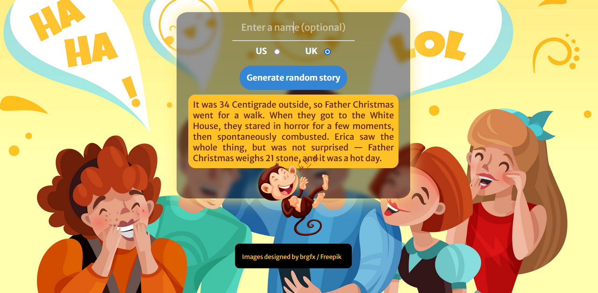

# Sayna Mini-Projects

This repository contains mini-projects I made through **[Sayna][]**\'s course\.   
Here is a list and details :  

- ### [Business Card][1] #  

    It is an example of business card\. Very simple and easy\.  

---

- ### [Cool Box][2] #

    Excellent exercise to get acquainted with \"box\-shadow\"\.

---

- ### [Fancy Letter][3] #

    A personalized letter\. Only using \"background\" propriety\.

---

- ### [Mozilla page][4] #

    A simple exercise with Javascript \(using localStorage\)\. It has two functions\.  
    - Changing the Mozilla's logo by clicking on it\.
     
    - It asks an username and displays it after\.  

---  

- ### [Flex Box][5] #   

    A few exercises showing how **Flex Box** works.   

---

- ### [Float][6] #

    How does float work? And problems you may see using this proprety.  

---  

- ### [Position][7] #  

    You can use the "position" proprety to specify how an element should be  
positioned on a web page.  

---  

- ### [MultiCol][8] #  

    This is the easiest way to put elements side by side.  

---  
- ### [Number Guessing Game][9] #   

    An introduction to Javascript, a simple guessing game. The user guesses a random number between 1-100.   

---   

- ### [Silly Story][10] #   

    A story generator using some simple JS' methods. Here's a screenshot of how it looks like.   

   

---   

[Sayna]: https://www.sayna.io "Sayna's official website"  
[1]: https://github.com/ERlCA/SAYNA-MiniProjects/tree/main/carte-visite
[2]: https://github.com/ERlCA/SAYNA-MiniProjects/tree/main/cool-box
[3]: https://github.com/ERlCA/SAYNA-MiniProjects/tree/main/fancy-letterHeaded-paper
[4]: https://github.com/ERlCA/SAYNA-MiniProjects/tree/main/mozilla-page
[5]: https://github.com/ERlCA/SAYNA-MiniProjects/tree/main/flex-box
[6]: https://github.com/ERlCA/SAYNA-MiniProjects/tree/main/float
[7]: https://github.com/ERlCA/SAYNA-MiniProjects/tree/main/position
[8]: https://github.com/ERlCA/SAYNA-MiniProjects/tree/main/multi-col
[9]: https://github.com/ERlCA/SAYNA-MiniProjects/tree/main/number-guessing-game
[10]: https://github.com/ERlCA/SAYNA-MiniProjects/tree/main/silly-story

[image]: https://github.com/ERlCA/SAYNA-MiniProjects/blob/main/silly-story/img/silly-story-page-screenshot.png